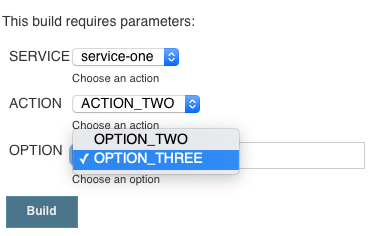

# Declarative Pipeline: Parallel Stages From List of Maps
## Why?
There's very little documentation on how to configure [Active Choices](https://plugins.jenkins.io/uno-choice/) parameters in a declarative pipeline.

This Jenkinsfile services as self-documentation of all the trial-and-error I've been through.

This is useful when you have a job that people tend to interact with where not all parameters are relevant to all run-modes.

## What does it look like?
The default selections for `ACTION_ONE` show a limited number of `OPTION`s (just one)

Changing the `ACTION` parameter causes the page to refresh, and `OPTION` now shows more entries as a result:

The "filter box" on the right allows dropdowns to be filtered by a text string...

Finally, the output of the job with the selected parameters show it all working:

## Setup
Sample steps to configure a new job using this Jenkinsfile in Jenkins 2:

  - **Jenkins Home**

  - **New Item**
    - **Item Name**: `<enter job name>`
    - **Type**: Pipeline

  - **Pipeline**
    - **Definition**: Pipeline script from SCM
      - **SCM**: Git
      - **Repositories**:
        - **Repository URL**: `git@github.com:hybby/jenkinsfiles.git`
        - **Branch Specifier**: `*/master`
        - **Script Path**: `declarative-activechoices-parameters/Jenkinsfile`

Hit **Save** and run it for the first time.

It'll fail, as the first run knows none of our parameters.

It'll work the second timea  You'll see **Build With Parameters** appear instead of **Build**.
