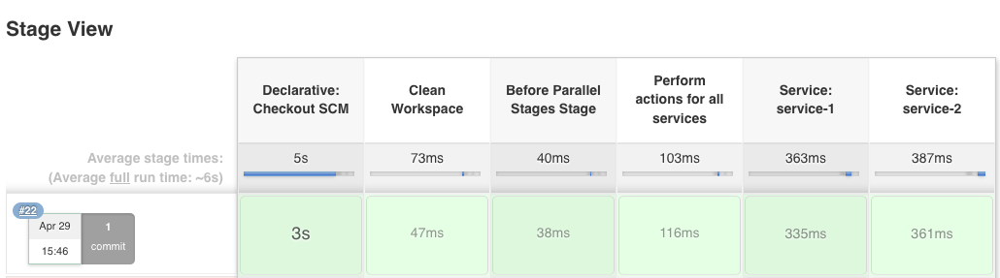
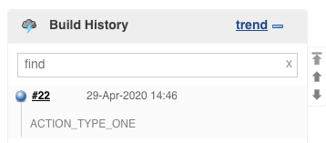
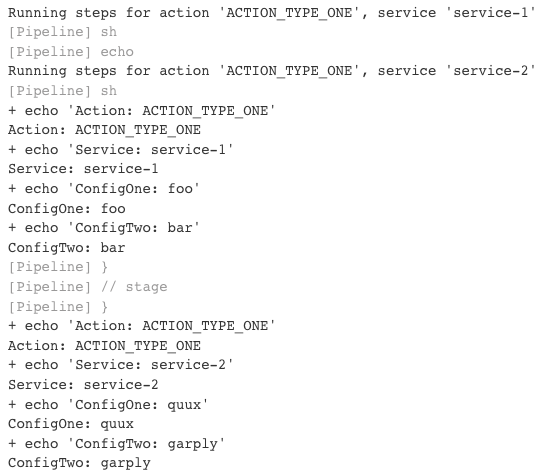

# Declarative Pipeline: Parallel Stages From List of Maps
## What does it look like?
### Stages

### Job history

### Job output

## Setup
Sample steps to configure a new job using this Jenkinsfile in Jenkins 2:

  - **Jenkins Home**

  - **New Item**
    - **Item Name**: `<enter job name>`
    - **Type**: Pipeline

  - **Pipeline**
    - **Definition**: Pipeline script from SCM
      - **SCM**: Git
      - **Repositories**:
        - **Repository URL**: `git@github.com:hybby/jenkinsfiles.git`
        - **Branch Specifier**: `*/master`
        - **Script Path**: `declarative-parallel/Jenkinsfile`

Hit **Save** and run it for the first time.

It'll fail, as the first run knows none of our parameters.

It'll work the second time.
